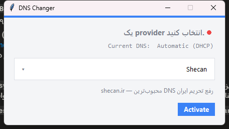
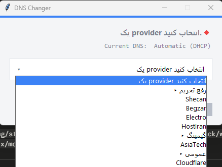

<div dir="rtl">

<p align="center">
  
</p>

<p align="center">
  <strong>🌐 Free DNS Setter</strong><br>
  <sub>تغییر DNS سیستم با یک کلیک یا یک دستور — برای کاربران ایرانی</sub>
</p>

<p align="center">
  <a href="LICENSE"></a>
  <a href="https://www.python.org/"></a>
  
  <a href="https://github.com/alisadeghiaghili/free-dns-setter/releases"></a>
</p>

<br>

---

<p align="center"><a href="README.en.md">🇬🇧 English README</a></p>

---

## چرا Free DNS Setter؟

در ایران گاهی نیاز است DNS سیستم را عوض کنیم: برای دسترسی به سرویس‌هایی که
محدود شده‌اند، کاهش پینگ در بازی‌ها، یا صرفاً داشتن رزولور سریع و پایدار.
این ابزار آن کار را به یک کلیک (یا یک خط در ترمینال) تبدیل می‌کند — و روی
**ویندوز، لینوکس (اوبونتو/دِبین) و مک** کار می‌کند؛ بدون دست زدن دستی به
تنظیمات شبکه.

## ویژگی‌ها

- ⚡ **یک کلیک** — رابط گرافیکی سادهٔ راست‌چین؛ یا یک خط در ترمینال
- 🖥️ **بدون وابستگی گرافیکی** — رابط با Tkinter (همراه Python) ساخته شده؛ نیازی به نصب PyQt/PySide نیست
- 🐧🍎🪟 **چندپلتفرمی** — ویندوز (WMI)، لینوکس/اوبونتو (NetworkManager) و مک (`networksetup`)
- 📦 **نسخهٔ آمادهٔ ویندوز** — `free-dns-setter.exe` تک‌فایل، بدون Python
- 🔄 **بازگشت ایمن** — قبل از هر تغییر، DNS فعلی ذخیره می‌شود؛ با `Deactivate`/`reset` به حالت پیشین برمی‌گردید
- 🔐 **اجرا با دسترسی ادمین** — خودکار؛ در ویندوز از طریق UAC و در لینوکس/مک از طریق `sudo`
- 🧩 **۹ سرویس‌دهندهٔ آماده** در سه دسته، با IPهای **تأییدشدهٔ عمومی**
- 🩹 **اشکال‌یابی واقعی** — کد بازگشتی سیستم‌عامل چک می‌شود و خطا نمایش داده می‌شود (نه شکست بی‌صدا)

## دسته‌ها

| دسته | کاربرد |
|------|--------|
| 🔓 **رفع تحریم** | دسترسی به سرویس‌های خارجی که ایران را محدود کرده‌اند |
| 🎮 **گیمینگ** | کاهش پینگ و دسترسی بهتر به سرورهای بازی |
| 🌐 **عمومی** | رزولورهای سریع، پایدار و امن برای استفادهٔ روزمره |

> ⚠️ هر IP داخلی قبل از اضافه‌شدن به‌صورت عمومی (از طریق PTR / رزولوشن)
> تأیید شده است. دستهٔ «رفع فیلتر» فعلاً سرویس‌دهندهٔ معتبرِ عمومی ندارد و
> در دسترس نیست.

## سرویس‌دهنده‌ها

| سرویس‌دهنده | دسته | Primary | Secondary |
|-------------|------|---------|-----------|
| Shecan | رفع تحریم | `178.22.122.100` | `185.51.200.2` |
| Begzar | رفع تحریم | `185.55.224.24` | `185.55.226.26` |
| Electro | رفع تحریم | `78.157.42.100` | `78.157.42.101` |
| HostIran | رفع تحریم | `37.27.81.177` | `5.144.130.130` |
| AsiaTech | گیمینگ | `185.98.113.113` | `185.98.114.114` |
| Cloudflare | عمومی | `1.1.1.1` | `1.0.0.1` |
| Google | عمومی | `8.8.8.8` | `8.8.4.4` |
| Quad9 | عمومی | `9.9.9.9` | `149.112.112.112` |
| DNS Pro | عمومی | `87.107.110.109` | `87.107.110.110` |

## نصب و اجرا

### روش ۱ — نسخهٔ آمادهٔ ویندوز (ساده‌ترین)

1. فایل `free-dns-setter.exe` را از
   [ریلیزها](https://github.com/alisadeghiaghili/free-dns-setter/releases) دانلود کنید.
2. روی آن دابل‌کلیک کنید. اگر درخواست ادمین (UAC) داد، **Yes** بزنید.
3. یک سرویس‌دهنده انتخاب کنید و **Activate** را بزنید.

> نیازی به نصب Python یا هیچ چیز دیگری نیست.

### روش ۲ — از سورس (لینوکس، مک و ویندوز)

پیش‌نیاز: **Python 3.11+** و دسترسی ادمین (برنامه در اجرای اول از طریق
`sudo`/UAC درخواست می‌کند). رابط گرافیکی در همهٔ سیستم‌عامل‌ها همان پنجرهٔ
Tkinter است.

**ویندوز ۱۰/۱۱**
```bash
pip install wmi rich
```
**لینوکس (اوبونتو/دِبین)**
```bash
sudo apt update && sudo apt install -y network-manager python3-tk
pip install rich
```
> NetworkManager (`nmcli`) در اوبونتو از قبل نصب است؛ خط بالا فقط برای
> اطمینان است. `python3-tk` بک‌اندِ Tkinter را فراهم می‌کند.

**مک (macOS)**
```bash
brew install python-tk      # اگر Tkinter وجود نداشت
pip install rich
```
> `networksetup` به‌صورت پیش‌فرض در مک هست؛ برای رابط گرافیکی به Tkinter نیاز دارید.

**اجرای رابط گرافیکی:**
```bash
python -m dns_changer.main
```

<p align="center">
  
</p>

**خط فرمان (CLI) — در همهٔ سیستم‌عامل‌ها:**
```bash
# منوی تعاملی
python -m dns_changer.cli.dns_cli

# دستورات مستقل
python -m dns_changer.cli.dns_cli list              # فهرست همهٔ سرویس‌دهنده‌ها
python -m dns_changer.cli.dns_cli status            # وضعیت فعلی DNS
python -m dns_changer.cli.dns_cli set Shecan        # فعال‌کردن یک سرویس‌دهنده
python -m dns_changer.cli.dns_cli reset             # بازگشت به حالت خودکار
```

## عیب‌یابی

| مشکل | راه‌حل |
|------|--------|
| پیام «تغییر DNS با خطا مواجه شد» | برنامه به دسترسی ادمین نیاز دارد. خودکار دوباره اجرا می‌شود (در ویندوز UAC، در لینوکس/مک `sudo`)؛ اگر بلاک شد، دستی اجرا کنید: `sudo python -m dns_changer.main` (لینوکس/مک) یا *Run as administrator* (ویندوز). |
| `nmcli not found` (لینوکس) | NetworkManager نصب نیست. `sudo apt install network-manager` (اوبونتو/دِبین) یا معادلِ توزیع خود را نصب کنید. |
| آنتی‌ویروس exe را خنثی کرد | نرم‌افزارهای تک‌فایلِ PyInstaller گاهی توسط آنتی‌ویروس‌ها علامت‌گذاری می‌شوند. از سورس (`pip install` و `python -m`) اجرا کنید یا exe را سفید‌فهرست کنید. |
| DNS بعد از ری‌استارت برنگشت | تغییر روی اتصال شبکهٔ فعال اعمال می‌شود. NetworkManager (لینوکس) یا DHCP (ویندوز) ممکن است هنگام اتصال مجدد آن را بازنشاند — پس از تغییر شبکه دوباره اجرا کنید. |

## معماری

ساختار لایه‌ای است؛ هر لایه مستقل و قابل تست:

```
dns_changer/
├── main.py                  # نقطهٔ ورود GUI
├── core/                    # منطق — بدون ایمپورت زودهنگامِ OS
│   ├── providers.py         # تعریف سرویس‌دهنده‌ها (برای افزودن، فقط اینجا)
│   ├── adapter.py           # تنها درزِ OS — WMI / nmcli / networksetup
│   └── dns_service.py       # state machine + اسنپ‌شات DNS
├── ui/
│   └── main_window.py       # رابط Tkinter (راست‌چین)
├── cli/
│   └── dns_cli.py           # CLI تعاملی + دستورات مستقل (rich)
└── utils/
    └── privileges.py        # ارتفای — UAC (ویندوز) / sudo (لینوکس، مک)
```

**افزودن سرویس‌دهندهٔ جدید:** فقط یک entry به `core/providers.py` اضافه کنید —
هیچ فایل دیگری تغییر نمی‌کند. **افزودن سیستم‌عامل جدید:** یک بک‌اند به
`core/adapter.py` و یک شاخه به `utils/privileges.py`.

## مشارکت

1. ریپازیتوری را Fork کنید:
   [github.com/alisadeghiaghili/free-dns-setter](https://github.com/alisadeghiaghili/free-dns-setter)
2. یک branch بسازید و تغییرات را با پیام‌های توصیفی
   (طبق [Conventional Commits](https://www.conventionalcommits.org/)) ثبت کنید
3. یک Pull Request باز کنید

## لایسنس

این پروژه تحت مجوز [Apache License 2.0](LICENSE) منتشر شده است.

---

<div align="center">
  <strong>علی صادقی عقیلی</strong><br>
  <a href="https://github.com/alisadeghiaghili">github.com/alisadeghiaghili</a>
  · <a href="mailto:alisadeghiaghili@gmail.com">alisadeghiaghili@gmail.com</a>
</div>

</div>
